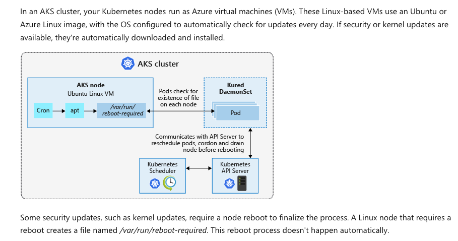

# AKS Nodes and Virtual Machines

## Overview

In an AKS cluster, your Kubernetes nodes run as Azure virtual machines (VMs). These Linux-based VMs use an Ubuntu or Azure Linux image, with the OS configured to automatically check for updates every day. If security or kernel updates are available, they're automatically downloaded and installed.

## Architecture Diagram

## How Node Updates Work

### Update Detection Process

The automatic update process works as follows:

1. **Cron Job**: A scheduled cron job runs daily on each AKS node
2. **Package Manager**: The cron job invokes `apt` (package manager) to check for available updates
3. **Reboot Flag**: If updates are available, they are downloaded and installed. When a reboot is required, apt creates a file named `/var/run/reboot-required`

### Pod-Level Detection

- **DaemonSet Monitoring**: Pods running in the **Kured DaemonSet** check for the existence of the `/var/run/reboot-required` file on each node
- **Communication with API Server**: When the reboot-required file is detected, the Kured DaemonSet communicates with the API Server to reschedule pods, cordon (mark as unschedulable), and drain the node before rebooting

### Orchestration

- **Kubernetes Scheduler**: Manages the scheduling of workloads across nodes
- **Kubernetes API Server**: Coordinates with the DaemonSet to orchestrate the node update and reboot process

## Manual Reboot Consideration

**Important:** Some security updates, such as kernel updates, require a node reboot to finalize the process. A Linux node that requires a reboot creates a file named `/var/run/reboot-required`. This reboot process doesn't happen you must manually trigger node updates or use Kured to automate this process.automatically

## Key Components

| Component | Purpose |
| --- | --- |
| **AKS Node (Ubuntu Linux VM)** | The virtual machine that runs Kubernetes workloads |
| **Cron** | Scheduled job that runs daily to check for updates |
| **apt** | Package manager that downloads and installs OS updates |
| **/var/run/reboot-required** | Indicator file that signals when a reboot is needed |
| **Kured DaemonSet** | Kubernetes daemon that monitors nodes and orchestrates reboots |
| **Kubernetes Scheduler** | Manages pod scheduling and node selection |
| **Kubernetes API Server** | Central control point for all cluster operations |

## Summary

The update process is designed to keep your AKS nodes secure and up-to-date automatically. However, the reboot process is deliberately not automatic to prevent unexpected downtime. You can use tools like Kured to automate the reboot scheduling in a controlled manner, or manually manage node updates according to your maintenance window policies.
