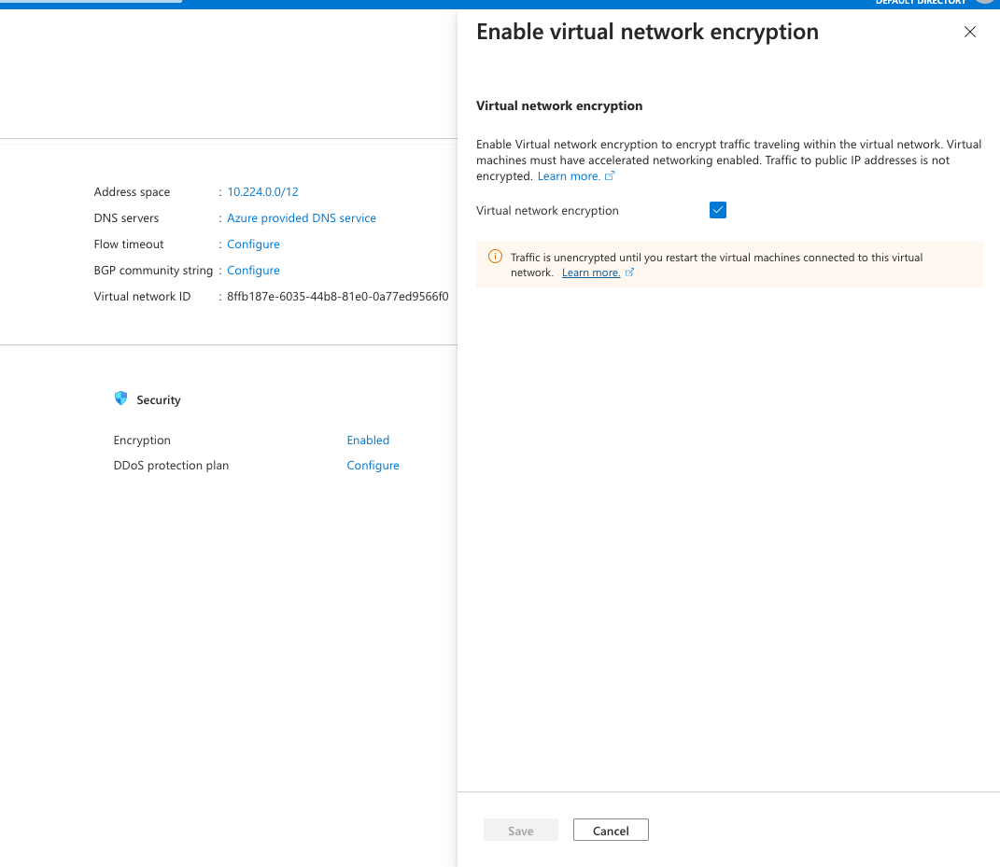

# Enabling Azure VNet Encryption

- Azure VNet Encryption went GA on 17/01/2024- https://azure.microsoft.com/en-us/updates/general-availability-azure-virtual-network-encryption-2/
- Setting up [VNet Encryption](https://learn.microsoft.com/en-us/azure/virtual-network/virtual-network-encryption-overview)


- The tricky part comes next when the user wants to see the logs that aid in encryption/decryption. This is possible via VNet flow logs- https://learn.microsoft.com/en-us/azure/network-watcher/vnet-flow-logs-cli
- Where is the encryption terminated?
    - The encryption is terminated at the SmartNIC/FPGA on the Azure Host.
- Interesting note from the Microsoft Team to enable VNet Encryption
```
Thank you for signing up to public preview of VNet flow logs, your interest in appreciated. We look forward to your feedback.

Due to deployment constraints, this feature is deployed on all Gen7 clusters in available regions but is not deployed on Gen8 clusters. This means if a VM is deployed on Gen7 cluster, VNet flow logging will work, but won’t be supported if a VM is deployed on Gen8 cluster. However, please note that deployment of a VM on a specific cluster is not configurable and is platform dependent.

To overcome this limitation, we are pinning subscriptions to Gen7 for those customers interested in trying this feature. This has the following implications:

1. All workloads in pinned subscription will be deployed on Gen7 host clusters for new VMs or re-deploy of existing VMs.

2. Due to capacity constraints, pinned subscriptions will be limited to 100 cores, deploying additional VMs will lead to quota allocation failures.

3.  To optimize available capacity it is recommended to use VMs with smaller sizes, i.e. D2/E2  to D8/E8 would be ideal. This is applicable to all VMs in the test subscription and not limited to VMs used to test the public preview as the entire subscription is pinned to Gen7 clusters.

4.  We recommend only 1 subscription per customer to test this feature and we advise not to use production workloads for test.

5.  While deployment is available in all regions mentioned in the documentation, Order of preferred regions due to capacity restrictions is – 1) West US, 2) West US 2, 3) East US, 4) East US 2. West US regions are preferred over EastUS.
```

