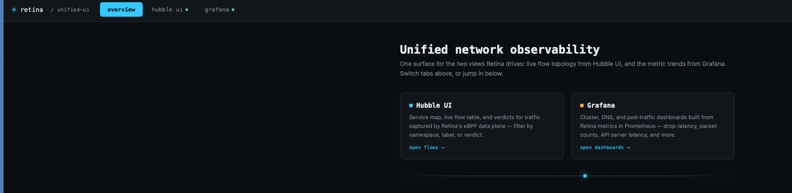
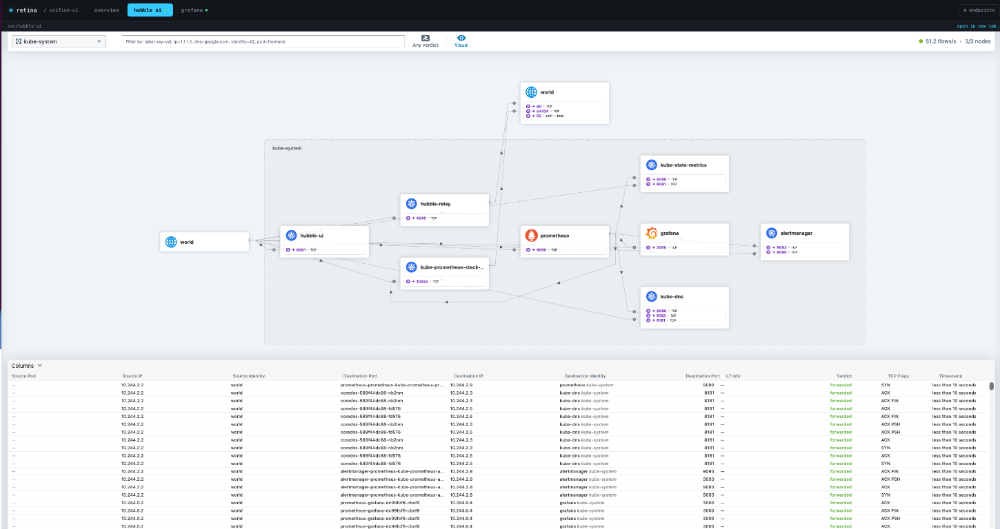
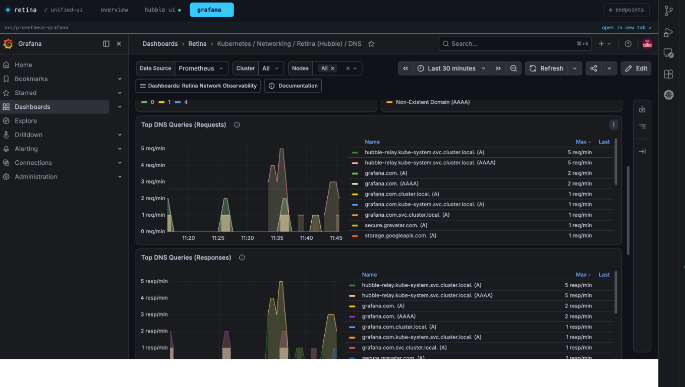

# Retina (Hubble) & Grafana Unified UI

A single page that tabs between **Hubble UI** (live flow topology) and **Grafana**
(Retina's Prometheus dashboards) so you don't have to juggle two browser tabs
while working with [Retina](https://retina.sh/).

It's one static file — `index.html` — with no build step and no backend. It
works by embedding each tool in an `<iframe>` and pointing the iframe at
whatever URL you tell it to, via the "⚙ endpoints" panel in the header.

## Screenshots







## Quick start (local dev, matches the Retina docs)

This assumes you've already installed Retina with the Hubble control plane
and Prometheus/Grafana, per the [Retina install docs](https://retina.sh/docs/Installation/Setup).

1. Port-forward both services, each in its own terminal:

   ```sh
   kubectl port-forward -n kube-system svc/hubble-ui 8081:80
   kubectl port-forward -n kube-system svc/prometheus-grafana 8080:80
   ```

2. Open `index.html` directly in your browser (double-click it, or
   `open index.html` / `xdg-open index.html`).

3. That's it — the defaults already point at `localhost:8081` (Hubble UI)
   and `localhost:8080` (Grafana). Use the **overview** tab to jump into
   either, or click the tabs directly. Get your Grafana login with:

   ```sh
   kubectl get secret -n kube-system prometheus-grafana \
     -o jsonpath="{.data.admin-user}" | base64 --decode; echo
   kubectl get secret -n kube-system prometheus-grafana \
     -o jsonpath="{.data.admin-password}" | base64 --decode; echo
   ```

If your ports differ, click **⚙ endpoints** in the header and change the two
URLs — they're saved in your browser's local storage, so you only set them
once.

## Serving it from the cluster instead of your laptop

`k8s/` contains manifests to run this page as an in-cluster nginx pod, so
anyone on the team can reach one URL instead of running port-forwards
themselves.

```
k8s/
├── configmap.yaml   # the index.html above, mounted into nginx
├── deployment.yaml  # nginx serving that configmap
├── service.yaml
└── ingress.yaml      # host-based routing for all three surfaces
```

Apply with:

```sh
kubectl apply -f k8s/
```

### Important: use host-based routing, not path-based

The manifests route by **hostname** —
`observability.example.com`, `hubble.example.com`, `grafana.example.com` —
rather than by path (`/hubble`, `/grafana`) on one host.

This is a deliberate choice, not a shortcut: Hubble UI's static assets are
built with absolute root paths (`/static/js/...`), and it has no built-in
"serve under a sub-path" option today, so mounting it at `/hubble/` behind a
reverse proxy will 404 on its own JS/CSS unless you add fragile HTML
rewriting rules. Host-based routing avoids that entirely — each app is
served from its own root, exactly the way it expects, and the landing page
simply iframes each hostname.

Grafana *does* support sub-path serving natively (`GF_SERVER_SERVE_FROM_SUB_PATH`),
so if you'd rather have everything under one hostname, you can do that for
Grafana alone — see the comment in `k8s/ingress.yaml`.

### Grafana: allow it to be iframed

By default Grafana refuses to render inside an iframe. Set this in your
`kube-prometheus-stack` Grafana values (or `grafana.ini` directly):

```yaml
grafana:
  grafana.ini:
    security:
      allow_embedding: true
      cookie_samesite: none
      cookie_secure: true   # required — browsers reject SameSite=None without Secure
      # Only needed if you hit blank/broken iframes while using SSO/OAuth login —
      # some browsers block third-party cookies inside iframes otherwise.
      # Leave this out to start; add it only if you actually see the problem.
      # cookie_samesite: disabled
```

Hubble UI does not set `X-Frame-Options`, so it embeds without extra config.

### After deploying

Update the endpoints in the unified UI (⚙ endpoints panel) to your real
hostnames, e.g. `https://hubble.example.com` and `https://grafana.example.com`,
or just edit the `DEFAULTS` object in `configmap.yaml` before applying so
they're correct out of the box.

## Notes

- There is a known issue with Safari and I will update in a near term fix. For now this works on Chrome.
  - Safari's Intelligent Tracking Prevention (ITP) blocks third-party cookies by default; so after you log in, Grafana sets its session cookie, but Safari refuses to store/send it back on the next request inside the iframe, and Grafana bounces you to the login page again. Chrome is much more permissive about this (especially over http://localhost), so it "just works" there but it's really only masking the underlying problem.
- This intentionally doesn't try to proxy or merge the two apps' HTTP
  traffic into one origin — that's the part that breaks in practice. Iframing
  two origins under one tabbed shell is the boring, reliable option.
- If your org's CSP or a corporate proxy blocks framing across origins,
  each pane also has an "open in new tab ↗" link as a fallback.
