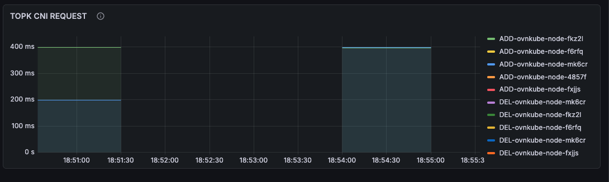
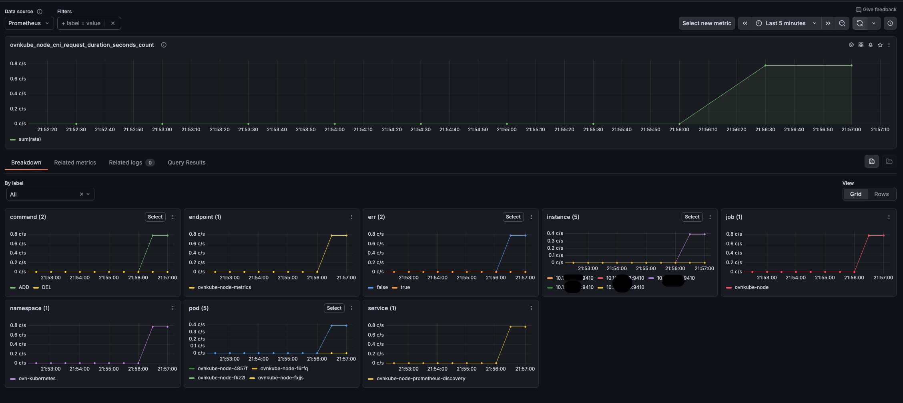

# CNI Add/Delete Events

This document shows how to inspect CNI add/delete events for OVN-K using Prometheus or Grafana.

## Access Grafana / Prometheus

```bash
# Port-forward Grafana and Prometheus to local ports
kubectl -n monitoring port-forward deployment/kube-prometheus-stack-grafana 3000:3000 --address 0.0.0.0
kubectl -n monitoring port-forward prometheus-kube-prometheus-stack-prometheus-0 9090:9090 --address 0.0.0.0
```

## Example Prometheus query (PromQL)

```promql
# Example: number of CNI add events in the last 5 minutes (replace metric with actual metric name)
increase(ovn_kubernetes_cni_add_total[5m])
```

## Grafana

Open the OVN-K SDN dashboards in Grafana and look for the CNI-related panels.





Notes: Replace the PromQL sample with the exact metric names collected in your environment.